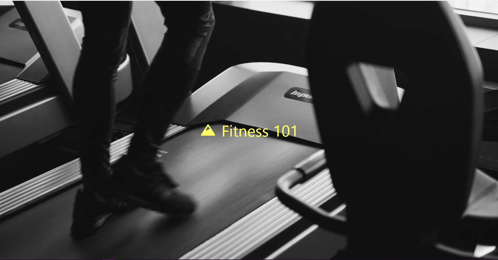

# Fitness 101

## Description
This project is a dynamic website crafted with Next.js, Tailwind CSS, and TypeScript, aimed at honing design skills, implementing subtle animations, and mastering element control. Leveraging Next.js for seamless routing and page management, the site ensures swift navigation and a smooth user experience.

Tailwind CSS enhances rendering efficiency and ensures consistent design aesthetics across various screen sizes. With a responsive design tailored for screens ranging from 4K displays to mobile devices, the website guarantees optimal performance and accessibility.

### Key Features
* Next.js for efficient page routing and management.
* Tailwind CSS for streamlined design and responsiveness.
* TypeScript for robust type-checking and enhanced code quality.

### Tools & Tech Used
* Next.js: Handles routing and page organization.
* Tailwind CSS: Enhances design aesthetics and responsiveness.
* TypeScript: Ensures type safety and code integrity.
* NPM: Manages project dependencies for enhanced functionality.
* Firebase: Hosts and manages the website for seamless online access.

## Images

## Future Plans
* Incorporate React components to enable dynamic rendering of product and informational pages.

* Explore expanding functionality with additional routes and features.

## Links
https://github.com/JoseJ55/fitness-website

https://fitness101-bbd78.web.app/